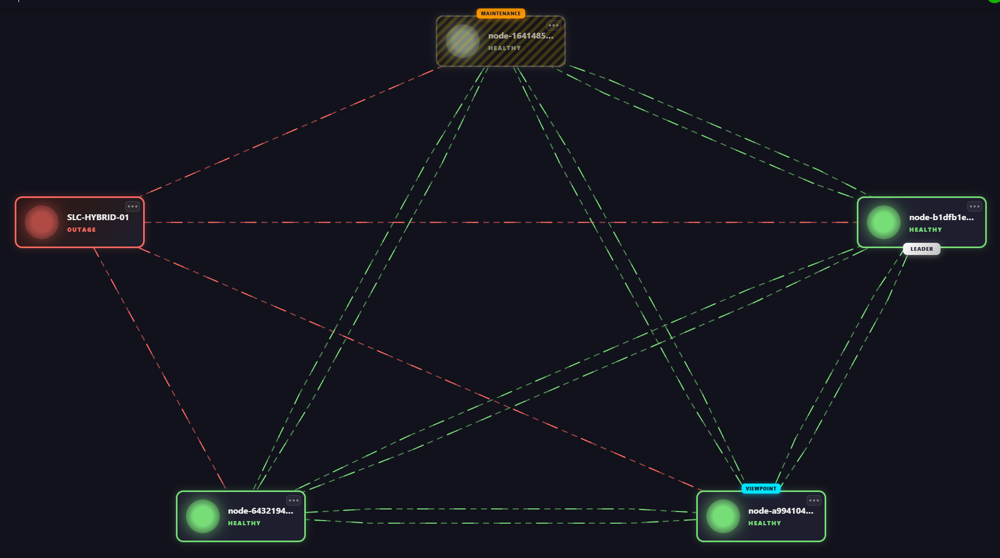

# Node Recovery Playground

## About

This is a sample application that will allow you to get acquainted with the concept of [Node Recovery](https://aka.dataminer.services/node-recovery).

## Prerequisites

To deploy this sample application from the Catalog, you will need the following:

- A DataMiner System connected to dataminer.services
- DataMiner version 10.6.3/10.6.0 or newer
- DataMiner Web version 10.6.4 or newer
- [Node Recovery](https://aka.dataminer.services/node-recovery) must be installed.
- Users will require the `AdminTool` permission to properly view the application.

> [!NOTE]
> To use this application you will need to [enable the swarming feature](https://aka.dataminer.services/enable-swarming), which comes with its own set of prerequisites.
